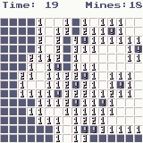

Minesweeper
====

A minesweeper game using WASM4 engine

<https://git.claudiomattera.it/claudiomattera/minesweeper/>

This game is a reimplementation of the classical Minesweeper game.

Playing
----

The goal of the game is to find all mines covered by a grid of tiles, by uncovering all safe tiles.
Uncovering a mine means game over!

The game is controlled through the mouse.
Left click on a tile to uncover it, right click on a tile to flag it.

Uncovered tiles show the number of adjacent mines, both vertically, horizontally and diagonally (or nothing, when there are no adjacent mines).

Flag tiles which you believe cover a mine.
After uncovering a tile, if the number of adjacent flagged tiles is equal to the number of adjacent mines, all non-flagged adjacent tiles are also uncovered.
Simultaneous left and right click on a numbered uncovered tile will uncover adjacent tiles.

Implementation
----

This game is implemented in [Rust] using the toolkit [WASM-4].
It is a bit over engineered, but it was a fun project to learn WASM-4 and improve knowledge about Rust.

The game can be embedded in a web page using [WebAssembly].
A standalone cartridge can be created with the following commands.

~~~~bash
cargo build --release
w4 bundle target/wasm32-unknown-unknown/release/minesweeper.wasm
      --title "Minesweeper"
      --description "A minesweeper game using WASM4 engine"
      --timestamp
      --html ./cartridge.html
~~~~

[Rust]: https://www.rust-lang.org/
[WASM-4]: https://wasm4.org/
[WebAssembly]: https://webassembly.org/

License
----

Copyright Claudio Mattera 2021

You are free to copy, modify, and distribute this application with attribution under the terms of the [MPL 2.0 license]. See the [`License.txt`](./License.txt) file for details.

[MPL 2.0 license]: https://opensource.org/licenses/MPL-2.0
